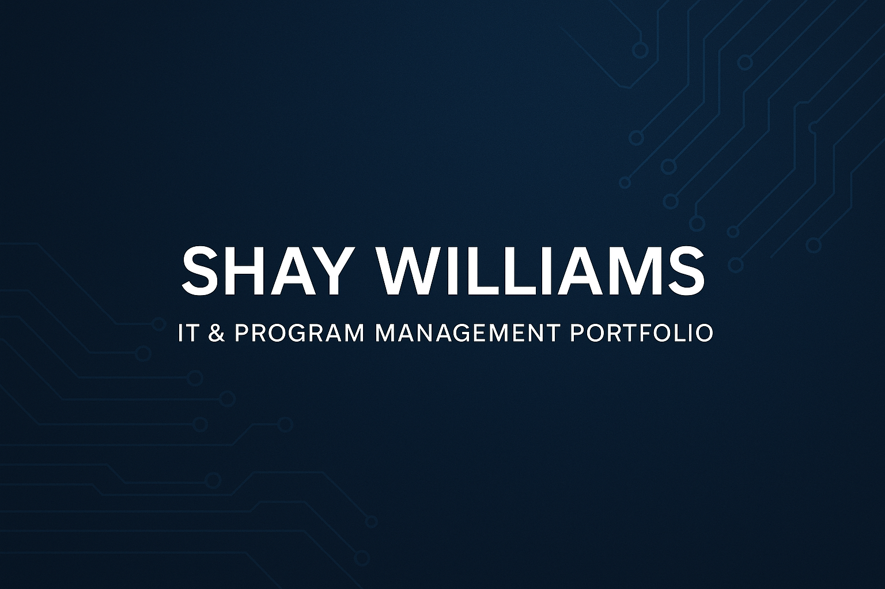

# 🌐 Shay Williams | IT Systems & Program Management Portfolio

Welcome to my professional IT portfolio — a collection of projects demonstrating my expertise in **program management, system administration, cybersecurity compliance, ERP strategy, and ITIL-based service improvement** across both corporate and military environments.

---

## 📂 Featured Projects
### 🔹 Endothon ERP Vendor Selection
- Led vendor evaluation and negotiation under a $10M budget.  
- Applied CoBit 5, ISO 20000, and EAR compliance frameworks for global ERP deployment.  
- Recommended Synesthor Ltd. as the preferred ERP partner, aligning governance and long-term cost transparency.
**Focus:** ERP Implementation | Outsourcing | Governance | Risk Mitigation  
**Read Full Case Study:** [📄 View Endothon ERP Case Study](docs/03565f20-046a-4984-b7fc-7c29957f7346.pdf)

---

### 🔹 Director of Systems Engineering & Networks
**Focus:** IT Infrastructure | Governance | ITIL Service Management | Leadership Development  
**Read Full Document:** [📄 View Director of Systems Engineering & Networks Role](docs/83296d02-8060-4967-b14c-d7ab45802661.pdf)

---

### 🔹 IT Organizational & Resource Plan (Steering Committee)
- Introduced AI-driven virtual agent proposals to improve Tier 1 service delivery.  
- Applied ITIL Change and Service Level Management for scalability and transparency.
**Focus:** Change Management | Continual Improvement | Relationship Management  
**Read Full Document:** [📄 View IT Organizational & Resource Plan](docs/9a6a3f11-49b3-4ee0-a2ac-72d5aa501797.pdf)

---

### 🔹 Collective Enterprise Proposal
- Authored a leadership role design ensuring global system uptime and ISO 27001 compliance.  
- Established predictive monitoring and ITIL service governance practices.
**Focus:** Modernization Strategy | Risk Management | Data Governance | Analytics  
**Read Full Document:** [📄 View Collective Enterprise Proposal](docs/66952880-cba6-4f94-b91b-9cb62711c766.pdf)

---

### 🔹 Director Role Proposal Summary
- Designed a dual-leadership framework integrating Business Intelligence and Systems Engineering.  
- Implemented real-time operational visibility through Power BI and predictive analytics.
**Focus:** IT Operations | Infrastructure Leadership | Performance Optimization  
**Read Full Document:** [📄 View Director Role Proposal](docs/5a0af232-288e-4851-bb70-4e62fbee4ce9.pdf)

---

## 🎓 Education & Certifications
- **M.S. in Information Technology Management** – Western Governors University *(Expected 2026)*  
- **B.S. & A.S. in Electronic Engineering Technology** – Hamilton Technical College  
- **Certified ScrumMaster® (CSM®)** – Scrum Alliance  
- **CompTIA Security+ CE** – CompTIA  
- *(In Progress)* Microsoft Certified: Azure Fundamentals (AZ-900)

---

## 📞 Contact
📧 **shaynettawilliams@gmail.com**  
🔗 [LinkedIn](https://www.linkedin.com/in/shay-williams85)  
📍 Frisco, TX  

---

© 2025 Shaynetta Williams. All rights reserved.  
This portfolio was built to highlight my work in **Enterprise IT Leadership, Cloud Transformation, and Secure Systems Strategy.**
